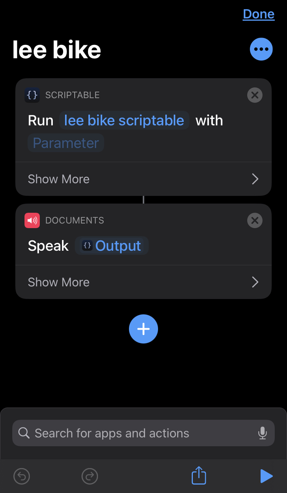
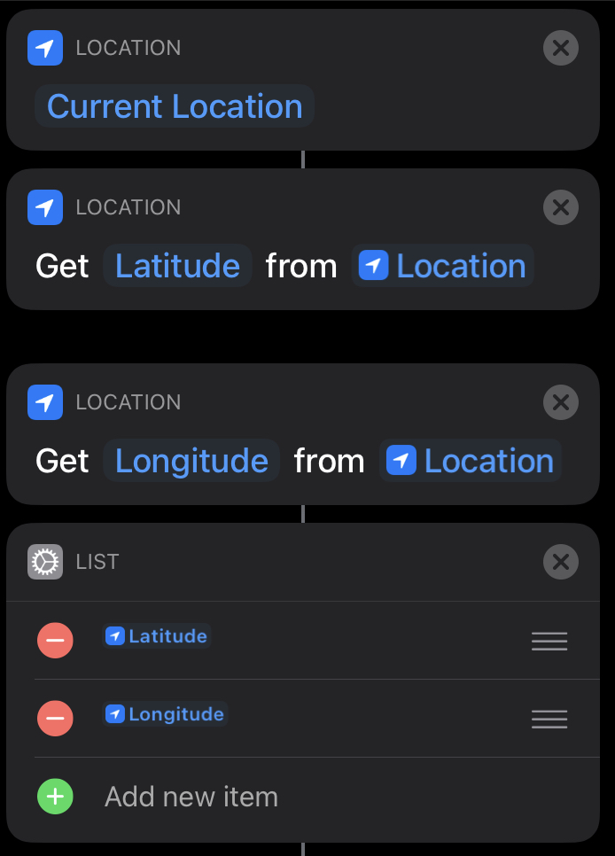

# citibike-status
Citi Bike dock availability with JavaScript ES6 and [Scriptable](https://scriptable.app/). This script queries Citi Bike's public APIs to output stations which have docks available. Citi Bike follows the [General Bikeshare Feed Specification (GBFS)
](https://github.com/NABSA/gbfs/blob/master/gbfs.md).

# environment
This was written in and executed in the iOS JavaScript ES6 editor and interpreter [Scriptable](https://scriptable.app/). This allows the code to be accessed as an [iOS shortcut](https://support.apple.com/guide/shortcuts/welcome/ios). With a variety of triggers, you can call the script based off GPS location, and setup the output message to be read by Siri

# iOS shortcuts
With the Scriptable app installed, you'll see the option to reference them in shortcuts. You can pass parameters in, and send the output of your script to other steps.

## Configurations

<table>
  <tr>
    <td>Setting output as spoken from Siri</td>
    <td>Using Current Location Latitude / Longitude</td>
  </tr>
  <tr>
    <td></td>
    <td></td>
  </tr>
</table>

### shortcut config
```yml
scriptable:
  - Run Bike-Status
documents:
  - Speak Output
```
### automation config
```yml
When:
 - When I arrive at ${address}
Do:
 - Run Shortcut Bike-Status
```
I set the address as 2 blocks away from where I need to decide which dock to go to and with a radius of 350'.
